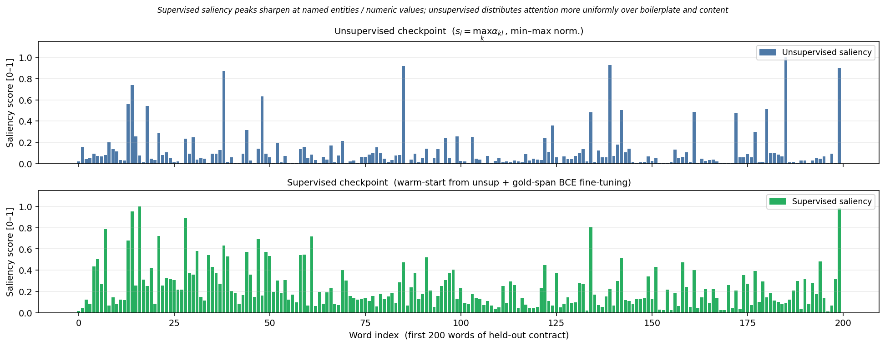

# Distorted OCR Compression

A course project exploring whether document saliency can guide text selection and rendering before OCR. MemSlot learns attention slots over frozen RoBERTa features using a reconstruction objective. Its word weights drive selection and font emphasis; DeepSeek-OCR decodes the rendered pages into text, which is passed to a separate QA reader.



Saved qualitative comparison of unsupervised and supervised warm-start checkpoints from `notebooks/MemSlot_Report.ipynb`, cell 6. This figure was extracted from the archived notebook, not regenerated. [Source record](assets/provenance.json).

## What is here

- `deepseek_pipeline/`: MemSlot saliency, OCR wrapper, text pruning/summarization, QA reader, and local span-QA diagnostics.
- `render/`: text rendering utilities used by the experiments.
- `notebooks/`: archived experiment notebooks, including the multipage OCR design. They retain their saved outputs and environment assumptions.
- `run.py`: an earlier question-conditioned LegalBERT pipeline, kept for reference.
- [Pipeline notes](docs/METHODOLOGY.md) and [multipage experiment plan](EXPERIMENT_DESIGN.md).

End-to-end OCR-to-QA evaluation remains unfinished. The saved saliency figure does not establish compression gains or downstream QA improvements. OCR visual tokens are internal to the OCR model; the QA reader receives decoded text. Matching tokenizer families does not make the OCR decoder and QA reader the same model.

## Offline checks

Python 3.10 or later:

```bash
python -m pip install -e .
python -m unittest discover -s tests -v
```

These checks use numerical fixtures and mocked OCR responses. They cover false positives on unanswerable questions, tied confidence scores, abstentions, exact word budgets, reading order, short-sequence saliency smoothing, and OCR return handling. They do not load models or call APIs.

`cuad_evaluate` is a local diagnostic evaluator with EM, token F1, trapezoidal precision–recall area, and precision at recall of at least 0.8. It is not the official CUAD evaluator. Scores from this implementation should not be presented as directly comparable to published CUAD results.

## Model experiments

Model execution requires separate dependencies, model weights, data, and suitable hardware. `requirements.txt` preserves the notebook environment dependencies; the lightweight package above is enough for offline checks. `DeepSeekOCRCompressor` accepts a model `revision` so a compatible checkpoint revision can be recorded explicitly.

The notebooks are research records rather than a verified end-to-end release. Inspect their paths, dependency versions, split construction, prompts, and API settings before running them. API summarization and QA reading use `DEEPSEEK_API_KEY` or `DASHSCOPE_API_KEY` and may incur charges. No model runs or API calls were made for the maintenance checks.
